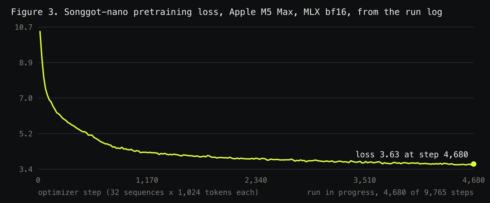
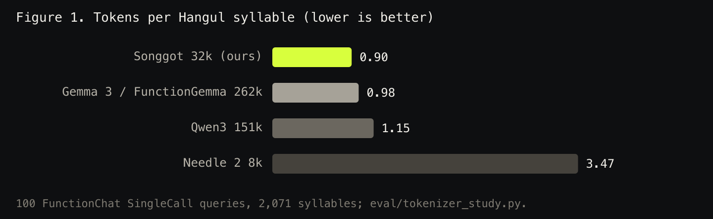
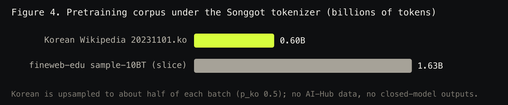
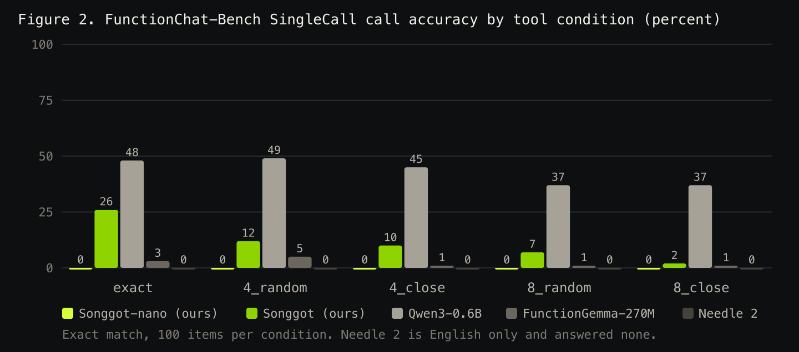

# Songgot (송곳): a Korean-first tiny agentic model for tool calling on the device

Hanish Keloth, Palette (Seoul and Bengaluru). Draft of 2026-09-10. Songgot rows in Table 2 are
written from the run logs as each training run finishes; nothing on this page is estimated.

## Abstract

Tiny agentic models (Needle 2, 45M parameters, 14 MB, July 2026) made on-device tool calling
practical on phones and microcontrollers, but the released model is English only. Songgot is a
Korean-first model in the same class: a decoder trained from scratch with a Korean-first 32k
tokenizer, bilingual Korean and English pretraining on licence-clean text, and post-training on
Korean tool-calling and structured-extraction data that no closed model touched. We evaluate on
Kakao's FunctionChat-Bench SingleCall (500 Korean items) with a deterministic exact-match scorer
that anyone can reproduce without an API key, against Needle 2, FunctionGemma-270M and Qwen3-0.6B
under identical prompts. Results for the comparators are measured and in Table 2; Songgot rows are filled from the run logs as each training run finishes (Songgot-nano on 2026-09-10). Weights, tokenizer, data generator, scorer and this paper
are released under Apache 2.0.

## 1. Why a Korean-first tiny model

- The class exists and is growing: Needle 2 passed 52,000 downloads within weeks of release.

- On Hugging Face as of 2026-09-09 there is no Korean tool-calling model under 1B parameters;
  the one Korean function-calling finetune found is a 2B Gemma.

- Korean is expensive for English-first tokenizers. On the 100 FunctionChat SingleCall queries,
  Qwen3's 151k vocabulary spends 1.15 tokens per Hangul syllable, Gemma's 262k vocabulary 0.98,
  and Songgot's 32k Korean-first vocabulary 0.90 (Table 1). At a 256 to 1024 token budget shared
  with tool schemas, that is context.

## 2. Model

Llama-style decoder, hidden 512, GQA with 8 query and 2 key-value heads, SwiGLU intermediate
1408, RoPE, tied embeddings, 32k vocabulary, trained from scratch. Two sizes: Songgot-nano, 8
layers, 39M parameters, pretrained on an Apple M5 Max with MLX (320M tokens); Songgot, 12 layers,
about 50M parameters, 8xH100 run on 6B tokens queued behind GPU budget.
Exports to safetensors, GGUF (f16, Q8_0, Q4_K_M) and runs under llama.cpp.

## 3. Tokenizer

SentencePiece BPE, 32,000 pieces, byte fallback, digits split, trained on a 300 MB sample:
Korean Wikipedia 50 percent, fineweb-edu 40 percent, tool-schema JSON 10 percent. Special
tokens `<|system|> <|user|> <|call|> <|end|> <|pad|>`. Post-training, evaluation and the app share one
tokenizer: llama.cpp's, driven through its Python bindings with a vocabulary-only GGUF (the five
specials typed as user-defined tokens). SentencePiece folds newlines into spaces and inserts a
space piece before each special; llama.cpp does neither, and it is what every GGUF user runs, so
the model is trained and scored on those ids.

Table 1. Tokens per Hangul syllable on the 100 FunctionChat SingleCall queries (2,071 syllables).

| tokenizer | vocab | tokens | tokens per syllable |
|---|---|---|---|
| Songgot (ours) | 32k | 1,873 | 0.90 |
| Gemma 3 / FunctionGemma | 262k | 2,028 | 0.98 |
| Qwen3 | 151k | 2,392 | 1.15 |
| Needle 2 | 8k | 7,192 | 3.47 |

## 4. Data

Pretraining (all disclosed, all licence-clean):

- fineweb-edu sample-10BT (ODC-By), first 1.63B tokens under our tokenizer.

- Korean Wikipedia, dump 20231101.ko (CC BY-SA 3.0), 0.60B tokens, upsampled to roughly half
  of the training mix.

- No AI-Hub data (its terms forbid leaving Korea and our GPUs do not sit there), no crawled
  Korean web text of unclear licence.

Post-training (101,464 examples, set v3): 64,000 Korean tool calls generated from hand-written
frames for 57 Korean tools (messaging, calendar, transit, home appliances, commerce, public
services, health, work, information), with register variants (반말, 존댓말, 격식, 사투리, typos) and
Korean date and time words resolved against a fixed calendar; 8,083 Korean calls generated by our own
Palette-K-Midm (open weights) as teacher; 27,948 English calls from glaive-function-calling-v2
(Apache 2.0) over thousands of distinct tools; 6 percent "no tool applies" negatives. Each prompt
carries 1, 3 to 6 or 8 tools; half of the multi-tool Korean prompts use close distractors (tools from
the target's own category), mirroring the benchmark's conditions.

Tool-name style augmentation, the change that mattered most: in 52,165 rows every tool is renamed in
a random style (camelCase, PascalCase, snake_case, digit or word suffixes, verb synonyms; 47,192
distinct names in the set) and the target call is renamed to match. Our first 12-layer model, trained
without it, scored 0.2 percent: it copied any invented snake_case name exactly and could not copy a
single camelCase one, because every name it had seen was snake_case (the benchmark mixes both). A
tiny model learns the name style it is shown; showing it every style teaches it to copy the name from
the prompt. Two related fixes: glaive's arguments are single-quoted and 97 percent of its calls had
failed to parse in earlier sets (the English part was 3,519 rows and mostly negatives), and "no tool"
was reduced from 28 to 6 percent because the benchmark never asks for it. No closed model produced a
label. A disjointness gate aborts the build if any training tool name or query appears in
FunctionChat-Bench.

Two later additions (sets v4 and v5, same day): 7,745 Korean rewrites of glaive requests produced by
our own Palette-K-Midm with the schemas and gold calls left untouched (Korean queries over thousands of
tools instead of 57), no-parameter tools upweighted, and every no-parameter schema rendered in one of
the three common JSON shapes at random. The last one came from reading failures: 45 of the benchmark's
57 no-parameter tools use `{"type":"object","properties":{},"required":[]}`, our set had almost only
bare `{}`, and the model had learned the shape instead of the rule. Each set was scored before the next
was built; Table 2 carries the published one and the text names the others.

Post-training recipe: full-parameter SFT, one epoch then a second at a lower rate, followed by a
similarity-reward RL stage (group-relative policy optimisation against the gold call, reward =
format term plus argument similarity as in STAR, Ni et al. 2026, with our own labels as the only
signal). Each stage is scored on the benchmark and a stage that lowers the score is not published;
Table 2 reports the published one. For the 12-layer model the RL stage tied the SFT score (11.4
percent before and after), and the published weights carry it.

What the RL stage measured. Three runs on the 12-layer model, 16 prompts x 8 samples per step, KL to
the frozen SFT model. Run 1 drew prompts from the post-training set: the group mean reward was
0.97-0.99 over the first 100 steps, the eight samples of a group almost always agreed, and the
benchmark did not move. Run 2 drew the same queries with every tool renamed to a name that never
appears in training: reward 0.84-0.99 over 140 steps, because the model reproduces the gold call for
a query it was trained on even when the tool is called something else. Run 3 used prompts the model
had never seen (1,575 Korean rewrites of glaive requests held out of post-training, their renamed
copies, and 3,000 held-out English rows): reward 0.70-0.85 with exact matches at 0.58-0.69, and real
disagreement inside each group, the first run with a gradient worth following. After 200 of those
steps the benchmark was still 11.4 percent, identical in every condition. A model this small
memorises its post-training queries, so on-policy RL can only teach what SFT has not already fixed,
and 200 steps of it on 3,200 novel prompts did not reach the benchmark's tools. The RL stage is
kept in the recipe as a measured negative, not as a source of the published number.

## 5. Evaluation

FunctionChat-Bench SingleCall (Kakao, 2024, Apache 2.0): 25 functions, 4 Korean queries each,
5 tool conditions (exact, 4 random, 4 close, 8 random, 8 close) = 500 items. The official
protocol uses GPT-4 as judge; we score with exact match on function name and arguments (numbers
compared as numbers, acceptable alternatives honoured) so the number is reproducible offline.
Every model receives the same tools and query, rendered in its own documented format.

Table 2. Call accuracy (exact match) on SingleCall, by tool condition, percent. Songgot rows are
written by the build from the run logs; a row reads "training" until its run has finished.

| model | params | exact | 4_random | 4_close | 8_random | 8_close | all | name only |
|---|---|---|---|---|---|---|---|---|
| Songgot-nano (Mac, 320M tokens) | 39M | 0.0 | 0.0 | 0.0 | 0.0 | 0.0 | 0.0 | 0.0 |
| Songgot (8xH100, 6B tokens) | 50M | 26.0 | 12.0 | 10.0 | 7.0 | 2.0 | 11.4 | 53.6 |
| Needle 2 | 45M | 0.0 | 0.0 | 0.0 | 0.0 | 0.0 | 0.0 | 0.0 |
| FunctionGemma-270M | 270M | 3.0 | 5.0 | 1.0 | 1.0 | 1.0 | 2.2 | 36.2 |
| Qwen3-0.6B | 600M | 48.0 | 49.0 | 45.0 | 37.0 | 37.0 | 43.2 | 70.8 |

## 6. Honest reading

- Songgot-nano sees 320M pretraining tokens; the Needle 2 recipe used 200B, about 600 times
  more. We expect that gap to show first in argument values (paraphrased places and times) and in
  rare tools, and we report every condition whatever it says. Where Songgot loses, this section
  will say so with the failing items named.

- The template-generated Korean data is narrow by construction; a teacher-generated set from
  our own Palette-K-Midm was planned and is queued behind GPU availability.

- The preview checkpoint used to open the demo on 2026-09-10 is an early one (65M tokens,
  24,000 post-training examples) and is labelled as such in the table.

## 7. Release

Weights and tokenizer: hf.co/palette-lab/songgot. Code, data generators, scorer, paper:
github.com/hanishkeloth/songgot. Licence Apache 2.0. Korean Wikipedia attribution and CC BY-SA
notice in the model card.

## 8. On the device

Songgot Pocket (hanishkeloth.github.io/songgot/app) is the model running inside the browser: llama.cpp
compiled to WebAssembly (wllama 3.6.1), the Q8_0 GGUF (42 MB) fetched once and kept in the browser
cache, no server in the loop. It installs as a web app on iOS, Android and desktop and keeps working with
the network off. The app shows the model at most six candidate tools per request (chosen by character
bigram overlap with a 58-tool Korean catalogue), renders the returned call as a card, and performs the
calls it can do locally (alarms, timers, notes, calendar files) while handing the rest to the right site
when online. Measured on 2026-09-10 in Chrome on an Apple M5 Max, single thread: 1.7 s per request from
prompt to parsed call. Phone numbers follow once the post-trained weights are up.
